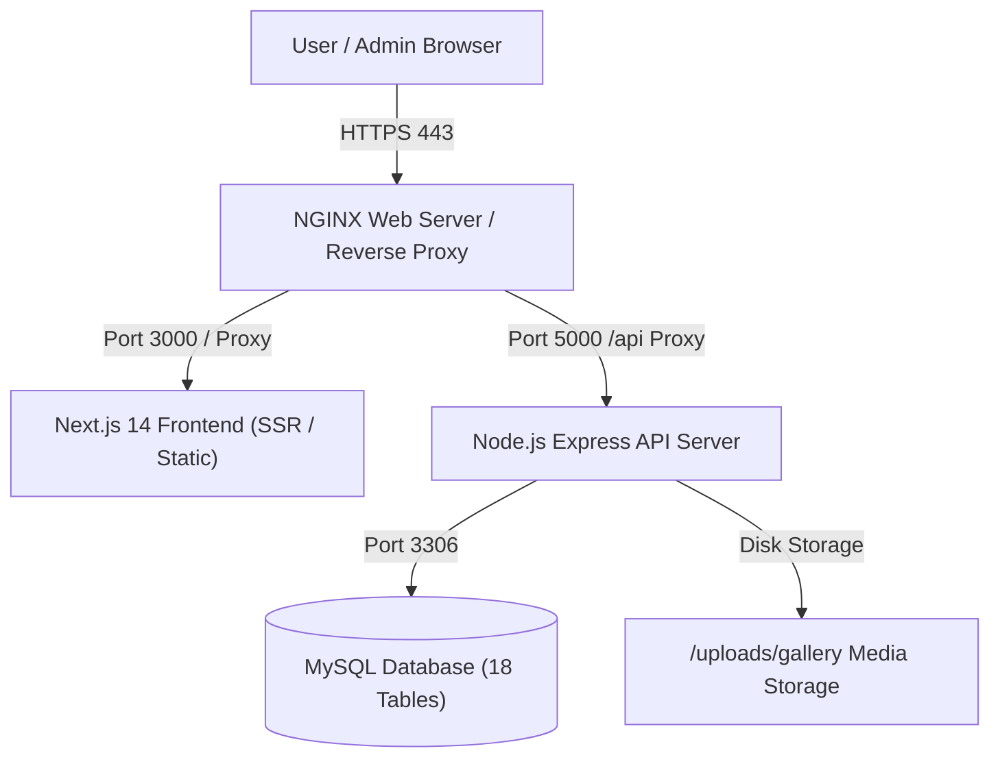

# 🚀 DOON RIDERS - COMPLETE PRODUCTION DEPLOYMENT GUIDE

A comprehensive, production-ready guide to deploying the **DOON Riders** platform (Next.js 14 Frontend + Node.js Express REST API Backend + MySQL Database).

---

## 📑 Table of Contents
1. [Architecture Overview](#1-architecture-overview)
2. [Prerequisites & Requirements](#2-prerequisites--requirements)
3. [Method 1: VPS / Cloud Server Deployment (Ubuntu / AWS / DigitalOcean / Hostinger)](#3-method-1-vps--cloud-server-deployment-recommended)
   - [Step 1: Server Setup & Dependencies](#step-1-server-setup--dependencies)
   - [Step 2: MySQL Server Installation & Database Setup](#step-2-mysql-server-installation--database-setup)
   - [Step 3: Clone Codebase & Install Packages](#step-3-clone-codebase--install-packages)
   - [Step 4: Run MySQL Migration & Seeding](#step-4-run-mysql-migration--seeding)
   - [Step 5: Setup PM2 Process Manager](#step-5-setup-pm2-process-manager)
   - [Step 6: Configure NGINX Reverse Proxy](#step-6-configure-nginx-reverse-proxy)
   - [Step 7: Enable SSL/HTTPS with Let's Encrypt](#step-7-enable-sslhttps-with-lets-encrypt)
4. [Method 2: Managed Cloud Platform (Vercel + Render/Railway + Cloud MySQL)](#4-method-2-managed-cloud-platform-serverless--free-tier-friendly)
5. [Method 3: 1-Click Docker & Docker Compose](#5-method-3-1-click-docker--docker-compose)
6. [Method 4: cPanel / Shared Hosting (Node.js Selector)](#6-method-4-cpanel--shared-hosting)
7. [Automated MySQL Backups (Cron Job)](#7-automated-mysql-backups)
8. [Environment Variables Reference](#8-environment-variables-reference)
9. [Security Hardening & Production Checklist](#9-security-hardening--production-checklist)
10. [Troubleshooting & FAQs](#10-troubleshooting--faqs)

---

## 1. Architecture Overview



| Component | Technology | Default Port | Production Role |
|---|---|---|---|
| **Frontend** | Next.js 14, React, Tailwind CSS | `3000` | Public website, EV Catalog, Dynamic Gallery, RBAC Admin Portal |
| **Backend** | Express.js, TypeScript, Multer, JWT | `5000` | REST API, Auth, CRM, Leads Pipeline, Fleet & Maintenance, Media Uploads |
| **Database** | MySQL 8.0+ / 5.7+ | `3306` | Enterprise schema with 18 tables, JSON settings, and RBAC matrix |

---

## 2. Prerequisites & Requirements

- **Domain Name**: e.g., `doonriders.com` (and `api.doonriders.com` or `/api` sub-path).
- **Server Specifications (Minimum)**:
  - 1 vCPU / 2 GB RAM (e.g., DigitalOcean $12/mo, Hostinger VPS, or AWS t3.small).
  - Ubuntu 22.04 LTS or 24.04 LTS.
  - 20 GB SSD storage.
- **Node.js**: v18.x or v20.x LTS.
- **MySQL**: v8.0 or v5.7.

---

## 3. Method 1: VPS / Cloud Server Deployment (Recommended)

### Step 1: Server Setup & Dependencies
Connect to your Ubuntu server via SSH:
```bash
ssh root@YOUR_SERVER_IP
```

Update system packages:
```bash
sudo apt update && sudo apt upgrade -y
```

Install **Node.js 20 LTS**, **Git**, and **Build Essentials**:
```bash
curl -fsSL https://deb.nodesource.com/setup_20.x | sudo -E bash -
sudo apt install -y nodejs git build-essential nginx certbot python3-certbot-nginx
```

Verify installations:
```bash
node -v   # Should output v20.x.x
npm -v    # Should output v10.x.x
```

Install **PM2** globally:
```bash
sudo npm install -g pm2
```

---

### Step 2: MySQL Server Installation & Database Setup

Install MySQL Server:
```bash
sudo apt install -y mysql-server
sudo systemctl start mysql
sudo systemctl enable mysql
```

Secure MySQL and create database & user:
```bash
sudo mysql
```

Run the following SQL commands in MySQL prompt:
```sql
-- Create Database with UTF8MB4
CREATE DATABASE IF NOT EXISTS doon_riders_db CHARACTER SET utf8mb4 COLLATE utf8mb4_unicode_ci;

-- Create Dedicated Database User (Replace 'YourStrongPassword123!' with your secure password)
CREATE USER 'doon_admin'@'localhost' IDENTIFIED BY 'YourStrongPassword123!';

-- Grant Full Privileges
GRANT ALL PRIVILEGES ON doon_riders_db.* TO 'doon_admin'@'localhost';
FLUSH PRIVILEGES;

-- Exit MySQL
EXIT;
```

---

### Step 3: Clone Codebase & Install Packages

Create app directory:
```bash
mkdir -p /var/www/doon-riders
cd /var/www/doon-riders
```

Clone your Git repository (or transfer files via SFTP/Git):
```bash
git clone https://github.com/YOUR_USERNAME/doon-riders.git .
```

#### Configure Backend:
```bash
cd /var/www/doon-riders/backend
npm install
```

Create Backend Production `.env` file:
```bash
nano /var/www/doon-riders/backend/.env
```
Paste the following:
```env
PORT=5000
NODE_ENV=production
CLIENT_URL=https://doonriders.com

# MySQL Database
MYSQL_HOST=localhost
MYSQL_PORT=3306
MYSQL_USER=doon_admin
MYSQL_PASSWORD=YourStrongPassword123!
MYSQL_DATABASE=doon_riders_db

# Security
JWT_SECRET=super_strong_random_jwt_secret_doon_riders_2026_prod
```
Save and exit (`CTRL+O`, `Enter`, `CTRL+X`).

#### Configure Frontend:
```bash
cd /var/www/doon-riders/frontend
npm install
```

Create Frontend Production `.env.local` file:
```bash
nano /var/www/doon-riders/frontend/.env.local
```
Paste the following:
```env
NEXT_PUBLIC_API_URL=https://doonriders.com/api
NEXT_PUBLIC_SITE_URL=https://doonriders.com
```
Save and exit (`CTRL+O`, `Enter`, `CTRL+X`).

---

### Step 4: Run MySQL Migration & Seeding

From the backend directory, execute the automated migration:
```bash
cd /var/www/doon-riders/backend
npm run migrate:mysql
```
> ✅ This will automatically execute `mysql_schema.sql` and `mysql_seed.sql`, creating all 18 tables, RBAC roles, users, scooty fleet, gallery images, and FAQs.

---

### Step 5: Setup PM2 Process Manager

#### 1. Build Backend & Frontend:
```bash
# Build Backend TypeScript
cd /var/www/doon-riders/backend
npm run build

# Build Next.js Frontend
cd /var/www/doon-riders/frontend
npm run build
```

#### 2. Create Uploads Directory & Set Permissions:
```bash
mkdir -p /var/www/doon-riders/backend/uploads/gallery
sudo chown -R www-data:www-data /var/www/doon-riders/backend/uploads
sudo chmod -R 775 /var/www/doon-riders/backend/uploads
```

#### 3. Start Processes with PM2:
```bash
# Start Backend API
cd /var/www/doon-riders/backend
pm2 start dist/server.js --name "doon-backend"

# Start Frontend Next.js
cd /var/www/doon-riders/frontend
pm2 start npm --name "doon-frontend" -- start -- -p 3000

# Save PM2 state & enable startup on reboot
pm2 save
pm2 startup
```
*(Copy and paste the `sudo env PATH=...` command that PM2 prints if prompted).*

Check running status:
```bash
pm2 status
```

---

### Step 6: Configure NGINX Reverse Proxy

Create an Nginx server block for DOON Riders:
```bash
sudo nano /etc/nginx/sites-available/doonriders.conf
```

Paste the following configuration (replace `doonriders.com` with your domain):
```nginx
server {
    listen 80;
    server_name doonriders.com www.doonriders.com;

    # Maximum file upload size (for Gallery images)
    client_max_body_size 25M;

    # 1. API Reverse Proxy -> Node Backend (Port 5000)
    location /api/ {
        proxy_pass http://127.0.0.1:5000/api/;
        proxy_http_version 1.1;
        proxy_set_header Upgrade $http_upgrade;
        proxy_set_header Connection 'upgrade';
        proxy_set_header Host $host;
        proxy_set_header X-Real-IP $remote_addr;
        proxy_set_header X-Forwarded-For $proxy_add_x_forwarded_for;
        proxy_set_header X-Forwarded-Proto $scheme;
        proxy_cache_bypass $http_upgrade;
    }

    # 2. Uploaded Media Files -> Backend Uploads directory
    location /uploads/ {
        alias /var/www/doon-riders/backend/uploads/;
        expires 30d;
        add_header Cache-Control "public, no-transform";
        access_log off;
    }

    # 3. Frontend App -> Next.js (Port 3000)
    location / {
        proxy_pass http://127.0.0.1:3000;
        proxy_http_version 1.1;
        proxy_set_header Upgrade $http_upgrade;
        proxy_set_header Connection 'upgrade';
        proxy_set_header Host $host;
        proxy_set_header X-Real-IP $remote_addr;
        proxy_set_header X-Forwarded-For $proxy_add_x_forwarded_for;
        proxy_set_header X-Forwarded-Proto $scheme;
        proxy_cache_bypass $http_upgrade;
    }
}
```

Enable site & test Nginx:
```bash
sudo ln -s /etc/nginx/sites-available/doonriders.conf /etc/nginx/sites-enabled/
sudo nginx -t
sudo systemctl restart nginx
```

---

### Step 7: Enable SSL/HTTPS with Let's Encrypt

Obtain a free SSL certificate for your domain:
```bash
sudo certbot --nginx -d doonriders.com -d www.doonriders.com
```

Select option `2` to redirect all HTTP traffic to HTTPS automatically.

Certbot will automatically configure auto-renewal:
```bash
sudo certbot renew --dry-run
```

🎉 **Your DOON Riders platform is now LIVE with full HTTPS!**
- **Website**: `https://doonriders.com`
- **Admin Portal**: `https://doonriders.com/admin/login`

---

## 4. Method 2: Managed Cloud Platform (Serverless / Free-Tier Friendly)

If you prefer not to manage a VPS:

### Step 1: Database on Managed Cloud MySQL
Use any cloud MySQL service:
1. **Aiven.io** (Free MySQL Plan) or **Railway MySQL** or **TiDB Cloud**.
2. Create a MySQL database named `doon_riders_db`.
3. Obtain your host, port, username, password.
4. Import `database/mysql_schema.sql` and `database/mysql_seed.sql` via MySQL Workbench / TablePlus / phpMyAdmin.

---

### Step 2: Deploy Backend on Render / Railway
1. Go to [Render.com](https://render.com) or [Railway.app](https://railway.app).
2. Create **New Web Service** pointing to your repository's `/backend` directory.
3. Set **Build Command**: `npm install && npm run build`
4. Set **Start Command**: `npm run start`
5. Add Environment Variables:
   - `MYSQL_HOST` = `<your-cloud-mysql-host>`
   - `MYSQL_PORT` = `3306`
   - `MYSQL_USER` = `<your-user>`
   - `MYSQL_PASSWORD` = `<your-password>`
   - `MYSQL_DATABASE` = `doon_riders_db`
   - `JWT_SECRET` = `<random-secret-key>`
   - `CLIENT_URL` = `https://your-frontend.vercel.app`
6. Click **Deploy**. Note down the Backend URL (e.g. `https://doon-riders-api.onrender.com`).

---

### Step 3: Deploy Frontend on Vercel
1. Go to [Vercel.com](https://vercel.com) and import your repository.
2. Select the **Root Directory** as `frontend`.
3. Add Environment Variable:
   - `NEXT_PUBLIC_API_URL` = `https://doon-riders-api.onrender.com/api`
4. Click **Deploy**.
5. Connect your custom domain in Vercel Settings (`doonriders.com`).

---

## 5. Method 3: 1-Click Docker & Docker Compose

If you have Docker and Docker Compose installed on any server:

```bash
cd "DOON Riders"

# Build and start all 3 containers (MySQL 8, Backend, Frontend) in background
docker compose up -d --build
```

Check running containers:
```bash
docker compose ps
```

Logs monitoring:
```bash
docker compose logs -f
```

---

## 6. Method 4: cPanel / Shared Hosting

If hosting on cPanel (with **Setup Node.js App** support):

1. **MySQL Database in cPanel**:
   - Go to **MySQL Databases** -> Create database `youruser_doon_db` and user `youruser_doon_admin`.
   - Go to **phpMyAdmin** -> Select database -> Click **Import** -> Upload `database/mysql_schema.sql` and then `database/mysql_seed.sql`.

2. **Backend Setup**:
   - In cPanel -> **Setup Node.js App** -> Create Application (Node.js 20, Application Root: `backend`, Application Startup file: `dist/server.js`).
   - Add environment variables in cPanel UI.
   - Run `npm run build` via cPanel terminal.

3. **Frontend Export / Next.js**:
   - Create a second Node.js app for `frontend` on custom port, or build statically and upload `.next/standalone` to public_html.

---

## 7. Automated MySQL Backups

To ensure your CRM leads, rentals, and customer KYC records are safely backed up daily:

Create a backup script:
```bash
sudo nano /usr/local/bin/backup_doon_mysql.sh
```

Paste:
```bash
#!/bin/bash
BACKUP_DIR="/var/backups/mysql/doon_riders"
TIMESTAMP=$(date +"%Y%m%d_%H%M%S")
mkdir -p "$BACKUP_DIR"

# Run mysqldump
mysqldump -u doon_admin -p'YourStrongPassword123!' doon_riders_db | gzip > "$BACKUP_DIR/doon_backup_$TIMESTAMP.sql.gz"

# Delete backups older than 30 days
find "$BACKUP_DIR" -type f -name "*.sql.gz" -mtime +30 -exec rm {} \;
```

Make it executable:
```bash
sudo chmod +x /usr/local/bin/backup_doon_mysql.sh
```

Add daily midnight Cron Job:
```bash
sudo crontab -e
```
Add line:
```cron
0 0 * * * /usr/local/bin/backup_doon_mysql.sh > /dev/null 2>&1
```

---

## 8. Environment Variables Reference

### Backend (`backend/.env`)
| Variable | Description | Example |
|---|---|---|
| `PORT` | API Server Port | `5000` |
| `NODE_ENV` | Environment mode | `production` |
| `CLIENT_URL` | Allowed frontend origin for CORS | `https://doonriders.com` |
| `MYSQL_HOST` | MySQL hostname | `localhost` or cloud DB host |
| `MYSQL_PORT` | MySQL port | `3306` |
| `MYSQL_USER` | MySQL database user | `doon_admin` |
| `MYSQL_PASSWORD` | MySQL user password | `YourPassword` |
| `MYSQL_DATABASE` | Database name | `doon_riders_db` |
| `JWT_SECRET` | Secret key for signing JWT auth tokens | `secure_random_string_64_chars` |

### Frontend (`frontend/.env.local` or Vercel Environment)
| Variable | Description | Example |
|---|---|---|
| `NEXT_PUBLIC_API_URL` | Public backend API URL | `https://doonriders.com/api` |
| `NEXT_PUBLIC_SITE_URL` | Website domain | `https://doonriders.com` |

---

## 9. Security Hardening & Production Checklist

- [x] **CORS Restricted**: In production, `CLIENT_URL` restricts API requests exclusively to your frontend domain.
- [x] **RBAC Protected**: All Admin APIs are secured with JWT and role permission verification (`SUPER_ADMIN`, `ADMIN`, `MANAGER`, `SALES_EXECUTIVE`).
- [x] **Password Hashing**: All passwords use bcrypt with salt factor 10.
- [x] **Upload Protection**: Multer limits uploads to valid images (JPG/PNG/WEBP) with a 15MB file ceiling.
- [x] **Firewall (UFW)**: Allow only SSH, HTTP, and HTTPS on your server:
  ```bash
  sudo ufw default deny incoming
  sudo ufw default allow outgoing
  sudo ufw allow ssh
  sudo ufw allow 'Nginx Full'
  sudo ufw enable
  ```
- [x] **MySQL Remote Access Disabled**: MySQL listens exclusively on `127.0.0.1` (local socket), blocking unauthorized external database connections.

---

## 10. Troubleshooting & FAQs

### Q1: I get a 502 Bad Gateway error on my domain.
- **Fix**: Check if PM2 processes are running:
  ```bash
  pm2 status
  pm2 logs doon-backend --lines 50
  pm2 logs doon-frontend --lines 50
  ```
- Make sure ports `3000` (frontend) and `5000` (backend) match your Nginx proxy configuration.

### Q2: MySQL connection refused (`ECONNREFUSED 127.0.0.1:3306`).
- **Fix**: Check MySQL service status:
  ```bash
  sudo systemctl status mysql
  sudo systemctl restart mysql
  ```
- Test connecting directly with credentials:
  ```bash
  mysql -u doon_admin -p -h 127.0.0.1 doon_riders_db
  ```

### Q3: Gallery image uploads fail with error 500 or EACCES.
- **Fix**: Ensure the `backend/uploads/gallery` directory exists and has proper write permissions:
  ```bash
  sudo mkdir -p /var/www/doon-riders/backend/uploads/gallery
  sudo chown -R www-data:www-data /var/www/doon-riders/backend/uploads
  sudo chmod -R 775 /var/www/doon-riders/backend/uploads
  ```

---

*Authored for DOON Riders Pvt. Ltd. — Electric Scooty Rental & Enterprise CRM Platform.*
